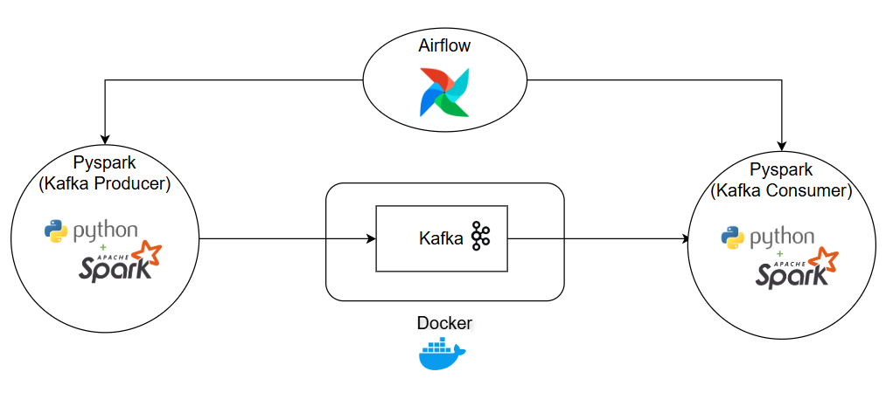

# ETL-With-Kafka-And-Airflow

## Objective
This project focuses on building a data processing and analysis system from log data of a streaming service. The main goal is to process that log data into OLAP output. 

Kafka is build on Docker for the messaging queue, PySpark for transforming the data from Kafka topic, Airflow for scheduling the PySpark scripts.

Tech stack: PySpark, Airflow, Kafka, Docker.

## Architecture

## Raw data

### Data Disctionary
| Column Name | Data Type |
|-------------|-----------|
| Contract | User ID |
| Mac | Device ID |
| TotalDuration | Total time user spend on the web |
| AppName | Name of the service |

## Clean data
### Data Disctionary
| Column Name | Data Type |
|-------------|-----------|
| Contract | User ID |
| Giải trí | The time the user spends on Entertainment programs |
| Phim Truyện | The time the user spends on Movies programs |
| Thiếu Nhi | The time the user spends on Kids' programs |
| Thể Thao | The time the user spends on Sports programs |
| Truyền Hình | The time the user spends on TV programs |
| TotalDevices | Total number of devices the user uses|

## Setup
### Airflow 
Installed Airflow on WSL: [airflow_setup.md](/Airflow/airflow_setup.md)

### Kafka on Docker
Kafka setup on Docker: [Kafka](/Kafka/)
### PySpark 
Install PySpark

